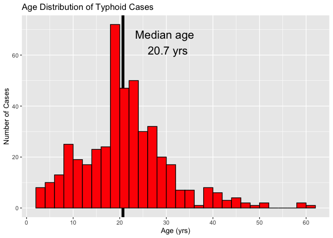

Nepal Typhoid Case Analysis
================
Chris LeBoa
2020-05-20

  - [Load Case Data](#load-case-data)
      - [Data Vis](#data-vis)
  - [Case Sex](#case-sex)
  - [Percentage that uses mostly unimproved
    water](#percentage-that-uses-mostly-unimproved-water)
      - [Making Table 1 from the case cohort
        data](#making-table-1-from-the-case-cohort-data)

``` r
# Libraries
library(tidyverse)
library(tableone)


# Parameters
file_redcap <-  "/Users/ChrisLeBoa/GitHub/nepal_typhoid/data/cases/redcap/redcap_data_nepal.rds"
file_cases_gis <- "/Users/ChrisLeBoa/GitHub/nepal_typhoid/data/cases/all_cases.shp"
ages_plot <- "/Users/ChrisLeBoa/GitHub/nepal_typhoid/reports/cases_ages.png"
table_one <- "/Users/ChrisLeBoa/GitHub/nepal_typhoid/reports/cases_table_1.csv"
```

## Load Case Data

``` r
#Find arms of interest
read_rds(file_redcap) %>% 
  distinct(redcap_event_name)
```

    ## # A tibble: 18 x 1
    ##    redcap_event_name
    ##    <chr>            
    ##  1 baseline_arm_6   
    ##  2 baseline_arm_3   
    ##  3 baseline_arm_5   
    ##  4 3_months_arm_3   
    ##  5 6_months_arm_3   
    ##  6 3_months_arm_5   
    ##  7 6_months_arm_5   
    ##  8 first_visit_arm_2
    ##  9 6_months_arm_2   
    ## 10 12_months_arm_2  
    ## 11 3_months_arm_2   
    ## 12 18_months_arm_2  
    ## 13 baseline_arm_1   
    ## 14 28_days_arm_1    
    ## 15 3_months_arm_1   
    ## 16 6_months_arm_1   
    ## 17 12_months_arm_1  
    ## 18 18_months_arm_1

``` r
#Create cases and case_cohort groupings 
cases <- 
  read_rds(file_redcap) %>% 
  filter(str_detect(redcap_event_name, "baseline_arm_1|first_visit_arm_2"))

case_cohort <- 
  read_rds(file_redcap) %>% 
  filter(
    str_detect(
      redcap_event_name,
      "baseline_arm_1|first_visit_arm_2|baseline_arm_3|baseline_arm_5"
    )
  ) %>% 
  mutate(
    case = 
      if_else(
        str_detect(redcap_event_name, "baseline_arm_1|first_visit_arm_2")
        , "Case"
        , "Cohort"
      )
  )
```

### Data Vis

\#Age Distribution of cases

``` r
cases %>% 
  ggplot(aes(x = age_final)) +
  geom_vline(aes(xintercept = median(age_final, na.rm = TRUE)), size = 2) +
  geom_histogram(
    binwidth = 2,
    boundary = 0,
    color = "black",
    fill = "red") + 
  annotate("text", x = 30, y = 65, size = 6, label = "Median age \n 20.7 yrs") +
  scale_x_continuous(breaks = scales::breaks_width(10)) +
  labs(
    title = "Age Distribution of Typhoid Cases",
    x = "Age (yrs)",
    y = "Number of Cases"
  ) 
```

    ## Warning: Removed 4 rows containing non-finite values (stat_bin).

<!-- -->

``` r
ggsave(ages_plot)
```

    ## Saving 7 x 5 in image

    ## Warning: Removed 4 rows containing non-finite values (stat_bin).

## Case Sex

``` r
cases %>% 
  count(sex) %>% 
  mutate(proportion =  n / sum(n))
```

    ## # A tibble: 3 x 3
    ##     sex     n proportion
    ##   <dbl> <int>      <dbl>
    ## 1     1   258    0.567  
    ## 2     2   193    0.424  
    ## 3    NA     4    0.00879

``` r
cases %>% 
  count(hftoiletshare) %>% 
  mutate(proportion =  n / sum(n))
```

    ## # A tibble: 5 x 3
    ##   hftoiletshare     n proportion
    ##           <dbl> <int>      <dbl>
    ## 1             0    92    0.202  
    ## 2             1    98    0.215  
    ## 3            97     1    0.00220
    ## 4            98     1    0.00220
    ## 5            NA   263    0.578

# Percentage that uses mostly unimproved water

``` r
cases %>% 
  count(hfdrwater) %>% 
  drop_na() %>% 
  mutate(proportion =  n / sum(n))
```

    ## # A tibble: 6 x 3
    ##   hfdrwater     n proportion
    ##       <dbl> <int>      <dbl>
    ## 1         1    43    0.225  
    ## 2         2     8    0.0419 
    ## 3         3    10    0.0524 
    ## 4         4    11    0.0576 
    ## 5         6   118    0.618  
    ## 6        98     1    0.00524

\#Proportion that treats drinking water

``` r
cases %>% 
  count(hftreatdkwater) %>% 
  drop_na() %>% 
  mutate(proportion =  n / sum(n))
```

    ## # A tibble: 3 x 3
    ##   hftreatdkwater     n proportion
    ##            <dbl> <int>      <dbl>
    ## 1              0   127    0.658  
    ## 2              1    65    0.337  
    ## 3             98     1    0.00518

``` r
#I didnt pull this record like I should have 
# cases %>% 
#   filter(hftreatdkwater == 1) %>% 
#   count(hftreatfreq) %>% 
#   drop_na() %>% 
#   mutate(proportion =  n / sum(n))
```

``` r
cases %>% 
  count(receivevacc) %>% 
  drop_na() %>% 
  mutate(proportion =  n / sum(n))
```

    ## # A tibble: 3 x 3
    ##   receivevacc     n proportion
    ##         <dbl> <int>      <dbl>
    ## 1           0   254    0.988  
    ## 2           1     2    0.00778
    ## 3          98     1    0.00389

## Making Table 1 from the case cohort data

``` r
sex_recode <- 
  c(
    "1" = "Male",
    "2" = "Female",
    .default = NA_character_
  )
toilet_share_recode <- 
  c(
    "0" = "No",
    "1" = "Yes", 
    .default = NA_character_
  )

water_type_recode <- 
  c(
    "1" = "piped water",
    "2" = "piped water",
    "3" = "improved well",
    "4" = "improved well",
    "6" = "unimproved well", 
    .default = NA_character_
  )

ses_recode <- 
  c(
    "1" = "<15000 Ruppee",
    "2" = "15000-30000",
    "3" = "30000-50000",
    "4" = ">50000", 
    .default = NA_character_
  )


list_vars <- c("Age", "Gender", "Toilet Sharing with > 1 Family", "Family Monthly Income", "Water Source", "Household treats drinking water", "Previously recieved typhoid vaccine")
cat_vars <- c( "Gender", "Toilet Sharing with > 1 Family", "Family Monthly Income", "Water Source", "Household treats drinking water", "Previously recieved typhoid vaccine")


case_cohort %>% 
  mutate(
    `Age` = age_final,
    Gender = recode(sex, !!! sex_recode), 
    `Toilet Sharing with > 1 Family` = recode(hftoiletshare, !!! toilet_share_recode),
    `Family Monthly Income` = recode(hf_famincome_nepal, !!! ses_recode),
    `Water Source` = recode(hfdrwater, !!! water_type_recode), 
    `Household treats drinking water` = recode(hftreatdkwater, !!! toilet_share_recode),
    `Previously recieved typhoid vaccine` = recode(receivevacc, !!! toilet_share_recode)
  ) %>% 
  CreateTableOne(
    vars = list_vars,
    factorVars = cat_vars,
    strata = "case",
     ) %>% 
  print(exact = "stage", quote = FALSE, noSpaces = TRUE)
```

    ##                                                Stratified by case
    ##                                                 Case         Cohort      
    ##   n                                             455          1699        
    ##   Age (mean (SD))                               21.36 (9.47) 11.58 (6.64)
    ##   Gender = Male (%)                             258 (57.2)   481 (53.1)  
    ##   Toilet Sharing with > 1 Family = Yes (%)      98 (51.6)    370 (41.2)  
    ##   Family Monthly Income (%)                                              
    ##      <15000 Ruppee                              11 (9.3)     87 (12.8)   
    ##      >50000                                     17 (14.4)    91 (13.4)   
    ##      15000-30000                                52 (44.1)    280 (41.2)  
    ##      30000-50000                                38 (32.2)    222 (32.6)  
    ##   Water Source (%)                                                       
    ##      improved well                              21 (11.1)    287 (32.8)  
    ##      piped water                                51 (26.8)    341 (39.0)  
    ##      unimproved well                            118 (62.1)   247 (28.2)  
    ##   Household treats drinking water = Yes (%)     65 (33.9)    438 (48.6)  
    ##   Previously recieved typhoid vaccine = Yes (%) 2 (0.8)      4 (0.5)     
    ##                                                Stratified by case
    ##                                                 p      test
    ##   n                                                        
    ##   Age (mean (SD))                               <0.001     
    ##   Gender = Male (%)                             0.175      
    ##   Toilet Sharing with > 1 Family = Yes (%)      0.011      
    ##   Family Monthly Income (%)                     0.736      
    ##      <15000 Ruppee                                         
    ##      >50000                                                
    ##      15000-30000                                           
    ##      30000-50000                                           
    ##   Water Source (%)                              <0.001     
    ##      improved well                                         
    ##      piped water                                           
    ##      unimproved well                                       
    ##   Household treats drinking water = Yes (%)     <0.001     
    ##   Previously recieved typhoid vaccine = Yes (%) 0.889

``` r
#mutate(case_type = recode(case_type, !!! vars_cases_recode))
```
