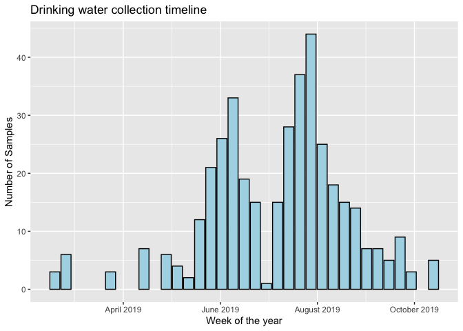
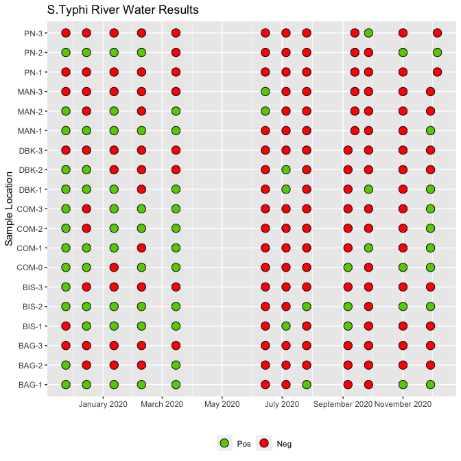
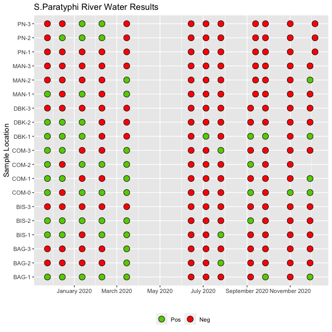
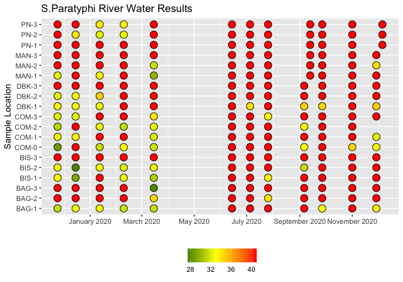

Water Sample Analysis World Water Conference
================
Chris LeBoa
2020-12-21

  - [Water Date](#water-date)
      - [River Positivity over time](#river-positivity-over-time)

``` r
# Libraries
library(tidyverse)
library(RCurl)
library(lubridate)

# Redcap API 

#For drinking water dates 
sees_nepal_data <- postForm(
  uri='https://redcap.stanford.edu/api/',
  token='1F2BCB605944BE0455E5CEA4FB4DE65E',
  content='report',
  format='csv',
  report_id='57256',
  csvDelimiter='',
  rawOrLabel='raw',
  rawOrLabelHeaders='raw',
  exportCheckboxLabel='false',
  returnFormat='csv'
)
#For River Positivity Analysis 
river_nepal_data <- postForm(
  uri='https://redcap.stanford.edu/api/',
  token='E7E4D521E860D283CC17037378399BA0',
  content='report',
  format='csv',
  report_id='74088',
  csvDelimiter='',
  rawOrLabel='raw',
  rawOrLabelHeaders='raw',
  exportCheckboxLabel='false',
  returnFormat='csv'
)

#read in data
nepal_sees_data <- read_csv(sees_nepal_data)
nepal_river_data <- read_csv(river_nepal_data)

#Parameters
pcr_threshold <- 35
#===============================================================================
```

## Water Date

``` r
nepal_sees_data %>% 
  mutate(water_week = floor_date(water_date, unit = "week")) %>% 
  ggplot(aes(x = water_week)) +
  geom_bar(fill = "light blue", color = "black") +
  scale_x_date(date_breaks = "2 months", date_labels = "%B %Y") +
  labs(
    title = "Drinking water collection timeline",
    y = "Number of Samples", 
    x = "Week of the year"
  )
```

    ## Warning: Removed 3663 rows containing non-finite values (stat_count).

<!-- -->

### River Positivity over time

#### Typhi

``` r
nepa_river_data_formatted <- 
  nepal_river_data %>%
  mutate_at(
    vars(matches("river_pcr")),
    ~as.double(recode(., "UD" = "99", .default = .)
    )) %>% 
  mutate(
    typhi_pos = 
      if_else(
        river_pcr_typhi_1_t16_ct < 35 | river_pcr_typhi_2_t16_ct < 35, "Pos", "Neg"),
    paratyphi_pos = 
      if_else(
        river_pcr_paratyphi_1_t16_ct  < 35 | river_pcr_paratyphi_1_t16_ct < 35,
        "Pos",
        "Neg"
        ), 
    sample_date = floor_date(as_date(river_datetime), "week")
  ) %>% 
  drop_na(typhi_pos)

nepa_river_data_formatted %>% 
  ggplot() +
  geom_point(
    aes(x = sample_date, y = sample_id, fill = as_factor(typhi_pos)),
    shape = 21, size = 4
    ) +
  scale_x_date(date_breaks = "2 months", date_labels = "%B %Y") +
  scale_fill_manual(values = c("chartreuse3", "red")) +
  theme(legend.position = "bottom") + 
  labs(
    title = "S.Typhi River Water Results",
    y = "Sample Location", 
    x = "", 
    fill = ""
  )
```

<!-- -->

``` r
nepa_river_data_formatted %>% 
  write_csv("/Users/ChrisLeBoa/Documents/Work/Research/Andrews Lab/SEES_DataCleaning/SEAPSEES_river_data_formatted.csv")
```

#### Paratyphi

``` r
nepal_river_data %>%
  mutate_at(
    vars(matches("river_pcr")),
    ~as.double(recode(., "UD" = "99", .default = .)
    )) %>% 
  mutate(
    typhi_pos = 
      if_else(
        river_pcr_typhi_1_t16_ct < 35 | river_pcr_typhi_2_t16_ct < 35, "Pos", "Neg"),
    paratyphi_pos = 
      if_else(
        river_pcr_paratyphi_1_t16_ct  < 35 | river_pcr_paratyphi_1_t16_ct < 35,
        "Pos",
        "Neg"
        ), 
    sample_date = floor_date(as_date(river_datetime), "week")
  ) %>% 
  drop_na(paratyphi_pos) %>% 
  ggplot() +
  geom_point(
    aes(x = sample_date, y = sample_id, fill = as_factor(paratyphi_pos)),
    shape = 21, size = 4
    ) +
  scale_x_date(date_breaks = "2 months", date_labels = "%B %Y") +
  scale_fill_manual(values = c("chartreuse3", "red")) +
  theme(legend.position = "bottom") + 
  labs(
    title = "S.Paratyphi River Water Results",
    y = "Sample Location", 
    x = "", 
    fill = ""
  )
```

<!-- -->
\#Color on replication value

``` r
nepal_river_data %>%
  mutate_at(
    vars(matches("river_pcr")),
    ~as.double(recode(., "UD" = "99", .default = .)
    )) %>% 
  mutate(
    typhi_pos = 
      if_else(
        river_pcr_typhi_1_t16_ct < 35 | river_pcr_typhi_2_t16_ct < 35, "Pos", "Neg"),
    paratyphi_pos = 
      if_else(
        river_pcr_paratyphi_1_t16_ct  < 35 | river_pcr_paratyphi_1_t16_ct < 35,
        "Pos",
        "Neg"
        ), 
    paratyphi_pos_num = if_else(
       river_pcr_paratyphi_1_t16_ct  > 35, 
       41, 
       river_pcr_paratyphi_1_t16_ct
    ),
    sample_date = floor_date(as_date(river_datetime), "week")
  ) %>% 
  drop_na(paratyphi_pos) %>% 
  ggplot() +
  geom_point(
    aes(x = sample_date, y = sample_id, fill = paratyphi_pos_num),
    shape = 21, size = 4
    ) +
  scale_x_date(date_breaks = "2 months", date_labels = "%B %Y") +
  scale_fill_gradient2(midpoint = 33, low = "dark green", mid = "yellow", high = "red") +
  theme(legend.position = "bottom") + 
  labs(
    title = "S.Paratyphi River Water Results",
    y = "Sample Location", 
    x = "", 
    fill = ""
  )
```

<!-- -->
